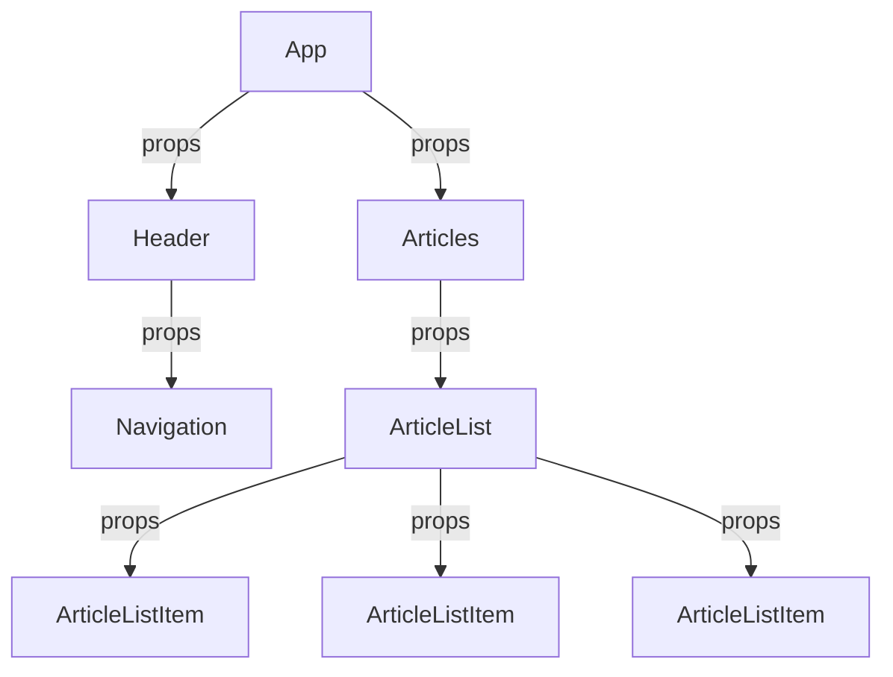

# Props

---

# Props / What are props?

```vue
<template>
  <PersonCard name="John Doe" />
</template>
```

- Props are custom attributes you can register on a component.
- When a value is passed to a prop attribute, it becomes a property on that component instance.
- Props are passed to a component similar to how HTML attributes are passed to HTML elements.
- Props are one-way data bindings: when the parent component’s property changes, that change will be reflected in the child component.

---

# Props / Diagram

<div class="flex justify-center h-full">

<div class="h-full w-lg">



</div>

</div>

---

# Props / Defining props

- Types: `String`, `Number`, `Boolean`, `Array`, `Object`, `Date`, `Function`, `Symbol`

```vue
<script>
export default {
  props: {
    name: {
      type: String,
      required: true,
    },
  }
}
```

---
 
# Props / Demo

<StackBlitzEmbed id="vue-qkhhjw" file="src/components/PersonCard.vue" />

---
layout: center
---

# 🏋️ Exercise 4 🏋️

1. Configure this component to accept the forecast as a prop
2. Write a validator for the data structure
3. Set a default value for the forecast (e.g. an empty array)
4. Move this data to the App.vue component
5. pass the forecast to this component as a prop
